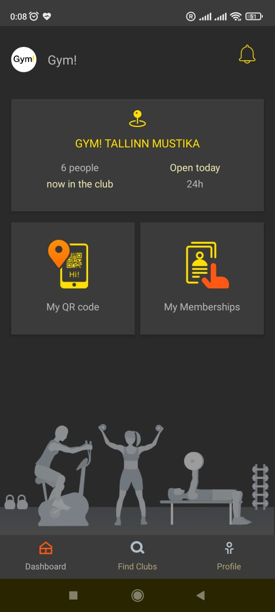
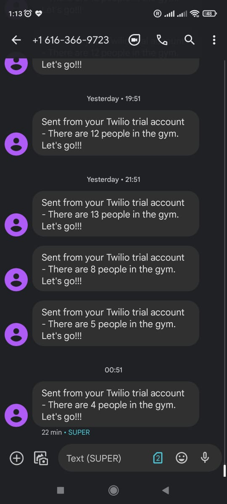

Salamlar. 

Bu kiçik məqalədə özüm üçün faydalı hesab etdiyim sadə bir proyekt haqqında danışacam. Məsələ idman zalına getməyə gəldikdə asanlıqla bəhanə tapa bilirəm adətən :). Nəzərə alsaq ki estonların idmanla arası yaxşıdır və yay fəslidir, işdən sonrakı saatlarda adətən zalda adam sayı normaldan çox olur. Bunu nəzərə alaraq kiçik bir notification servis yazmaq qərarına gəldim. Proyektin ideyası ondan ibarətdir ki, hər saat başı zalda olan adamların sayını yoxlamalı və əgər say 20-dən azdırsa (20, 25dən çox adam olduqda sıxlıq hiss olunur) SMS göndərərək idmana getməyi xatırlatmalıdır.

Proyektin ən vaxt aparan hissəsi zalda olan adamların sayını əldə etmək idi. Bunun üçün ən ilk addım kimi veb sayta daxil olaraq oradan adamların sayını əldə edə biləcəyimə inanırdım. Web scraping istifadə edərək bunun çox asan olduğunu düşünsəm də təəssüf ki, hesabıma daxil olduqdan sonra burada bu məlumatın əks olunmadığını aydın oldu. Yalnızca mobil tətbiqlərində bu mövcuddur bu rəqəm.



Növbəti addım olaraq android tətbiqdən məlumatın necə götürülməsini araşdırmaq lazım gəldi. Nəzəri olaraq bunun mümkünlüyünu bilsəm də praktiki təcrübəm olmadığı üçün hansı tool'dan istifadə edə biləcəyimə qərar verə bilmirdim. QA mühəndisi olaraq çalışan iş yoldaşım mənə [Charles proxy](https://www.charlesproxy.com/) adlanan proxy və monitoring tool'u məsləhət gördü (Bunu oxuyub anlamasan da təşəkkürlər, Madis :)).

Kompüterə yüklədikdən sonra mobil telefonda da şəbəkə parametrlərini dəyişmək tələb olunur ki, telefondan çıxan trafik internetə çıxışından əvvəl bu proxy'dən keçsin və izləmə mümkün olsun. Daha detallı bu [məqalədə](https://community.tealiumiq.com/t5/Tealium-for-Android/Setting-up-Charles-to-Proxy-your-Android-Device/ta-p/5121) izah olunub.

Bu addımda çox vacib bir məqam haqqında danışmaq lazımdır. Android 7 və sonrakı versiyalarında unstrusted SSL sertifikat yüklənilməsi təhlükəsizlik səbəbi ilə mümkün olmadığı üçün öz şəxsi telefonumdan istifadə (hansı ki, android 11 versiyası ilə işləyir) işə yaramadı - traffiki görə bilsəm də encrypted olduğu üçün praktiki olaraq lazımsız idi. Bu arada, IOS platformasında bu problem mövcud deyil. Bu problemi həll etmək üçün biraz çətin də olsa Android 6 versiyası ilə işləyən cihaz tapa bildim. 

SSL proxy enable etdikdən sonra cihaza SSL sertifikatını yükləyib yenidən mobil tətbiqi açdım və bütün "network request"lərini izləməyə başladım.

Bütün movcud log'lar daxilində URI hissəsindən lazım olan APİ endpoint'in bu olduğu aydın oldu:

```
https://goapi2.perfectgym.com/v1/Clubs/WhoIsInCount
```
Bu arada, URI kimi  `PascalCase` istifadəsi qəribə görünür :D.

Request'ə ətraflı baxdıqda header hissəsində authorization header'ının olduğu aydın oldu. Burada sadə token auth istifadə olunub. Token-in expire vaxtının olmaması (təhlükəsizlik baxımından çoxda yaxşı ideya olmasa da) bizi müəyyən zaman periodundan bir token yeniləmək üçün digər bir endpoint-ə request atmaq problemindən xilas etdi. Tokeni sadəcə save edib bütün requestlərdə istifadə etmək kifayət edir.

Tokeni istifadə edib `CURL` ilə request atdıqda aşağıdakı şəkildə JSON nəticə əldə etdik:

```JSON
{
    "data": [
        {
            "count": 11,
            "clubId": 374
        },
        {
            "count": 1,
            "clubId": 18
        },
        {
            "count": 5,
            "clubId": 17
        },
        {
            "count": 3,
            "clubId": 491
        },
        {
            "count": 4,
            "clubId": 752
        },
        {
            "count": 5,
            "clubId": 873
        }
    ],
    "errors": null
}

```
Buradan aydın olur ki, hərbir idman zalına bir id verilib və daimi getdiyim zalın `clubId` dəyərini tapmaq üçün mobil tətbiqdə ve bu responseda olan `count` dəyərlərini müqayisə etmək kifayət etdi.

Növbəti addım isə servisin kodlarını yazmaqdır. İstifadə edilən "tech stack":

1. AWS Lambda
2. Serverless framework (IaC) 
3. AWS EventBridge (Scheduled event'lər üçün)
4. Twilio SMS gateway
5. Python Twilio SMS SDK
6. CloudWatch (loglar)

İlk addım olaraq Serverless proyektin yaratmaq lazımdır. Bunun üçün detallı yazdığım bu [mənbəyə](https://github.com/Bakhtiyar-Garashov/AWS-serverless-starter) istinad edə bilərsiniz.

Daha sonra proyekt daxilində bir `config.py` faylı yaradıb daxilində aşağıdakı Python kodlarınl əlavə edək

```Python
from typing import Final
import logging

logger = logging.getLogger()
logger.setLevel(logging.INFO)

API_URL: Final[str] = "https://goapi2.perfectgym.com/v1/Clubs/WhoIsInCount"
TOKEN: Final[str] = "proxy loglardan əldə edilən token"

TWILIO_SID: Final[str] = "twilio.com dan əldə edilməli"
TWILIO_AUTH_TOKEN: Final[str] = "twilio.com dan əldə edilməli"
TWILIO_PHONE_NR: Final[str] = "twilio.com dan əldə edilməli, hansı ki SMS bu nömrədən gəlir"

MY_CLUB_ID: Final[int] = 752 # idman zalının id

```

Daha sonra SMS göndərmək üçün olan köməkçi funksiyanı yazaq. Daha əvvəl istifadə etdiyiniz paket meneceri ilə Twilio SDK yükləmək tələb olunur. `utils.py` faylı yaradıb aşağıdakı kodları əlavə edək:

```Python
from config import logger, TWILIO_SID, TWILIO_AUTH_TOKEN, TWILIO_PHONE_NR
from twilio.rest import Client

def send_sms(phone: str, message: str)->bool:
    """
    Send a SMS message to a phone number.
    """

    try:
        client = Client(TWILIO_SID, TWILIO_AUTH_TOKEN)
        message = client.messages.create(
                              from_=TWILIO_PHONE_NR,
                              body =message,
                              to =phone
                          )
        logger.info(f"SMS sent to {phone}")
        logger.info(f"SMS ID: {message.sid}")
        return True
    except Exception as e:
        logger.error(e)
        return False

```

Burada həmçinin standard kitabxanaya daxil olan `logging` paketi də istifadə olunub. Logging paketi ilə bütün loglar AWS CloudWatch servisində toplanır.

Və sonda, əsas məntiqi özündə ehtiva edən `handler.py` faylına aşağıdakı kodları əlavə edək

```Python
import json
import requests
from config import API_URL, TOKEN, MY_CLUB_ID, logger
from utils import send_sms

def notify(event, context):
    logger.info("Starting...")
    response = requests.get(API_URL, headers={"Authorization": "Bearer " + TOKEN})
    logger.info("Response: %s", response.text)
    parsed_response = json.loads(response.text)
    nr_of_people = list(filter(lambda x: x["clubId"] == MY_CLUB_ID, parsed_response["data"]))[0]["count"]
    logger.info("Nr of people: %s", nr_of_people)

    if nr_of_people >= 0 and nr_of_people <= 20:
        logger.info("Sending SMS...")
        send_sms("+37257839690", "There are %s people in the gym. Let's go!!!" % nr_of_people)
        logger.info("SMS sent")
    else:
        logger.info("Not a time for gym. No SMS sent")

```
Servisimizin kodları hazırdır. Deploy etməzdən əvvəl bu servisin 1 saatdan bir işə düşməsi üçün EventBridge `schedule` parametrini yazmaq lazımdır. `serverless.yml` faylında aşağıdakı əlavə edilməli:


```yaml
functions:
  reminder:
    handler: handler.notify
    events:
      - schedule: rate(1 hour)
```

Bununla da kodları deploy edib test edə bilərik.

```bash
serverless deploy --verbose --config serverless.yaml --aws-profile {your_profile} --stage Prod
```



Göründüyü kimi hər saatın 51-ci dəqiqəsində SMS qəbul edə bilirik. 

P.s: Hər SMS'in ilk cümləsi pulsuz SMS servisindən istifadə edildiyi səbəbindəndir.

Oxuduğunuz üçün təşəkkürlər...